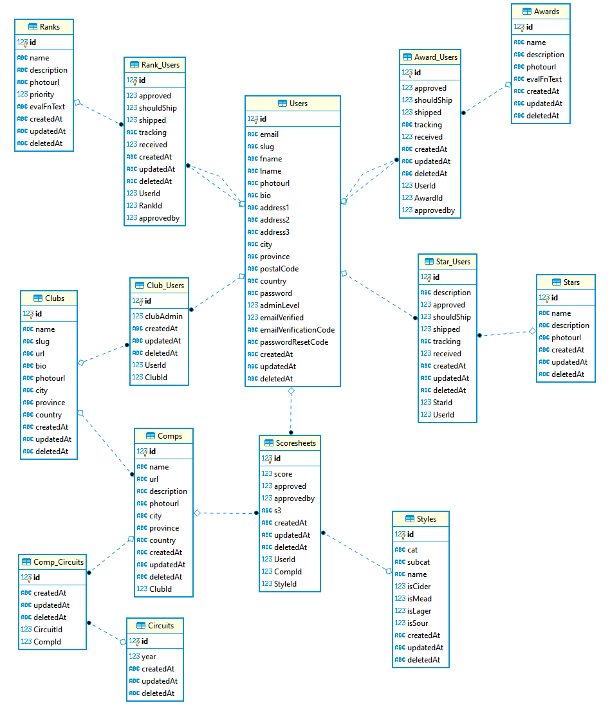

# MHP Server

### Development Quickstart

Clone the repo using git

```bash
git clone https://github.com/MasterHomebrewerProgram/mhp-server.git
cd mhp-server
```

Install dependencies with `npm`

```bash
npm install
```

Initialize and seed the database

```bash
npm run init:dev
```

Run the server

```bash
npm run dev
```

### Database Schema


